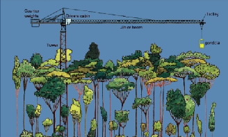

title: The Canopy Crane
date: 2015-02-22 14:27:47
parents:
  'The Observatory': ../the-observatory
---

TODO: Say 'no schoolkids' in here somewhere

The crane is a Liebherr 91 EC, freestanding construction tower
crane (see figure below). The crane is 47 metres tall (154 feet)
with a radius of 55 metres (180 feet). It can rotate 360 degrees
enabling access to 1 hectare of rainforest. A suspended basket
(gondola or dogbox) is attached at the hook to carry personnel
into the canopy.

Personnel access the gondola at ground level.  Movement of the
gondola to a specific position requires rotation of the entire
jib in a horizontal plane until the jib is above the position
desired. The trolley is then moved along the jib and the hook
and gondola are lowered to the desired position.

TODO: replace this crappy jpeg with a better resolution pic.

### Operational details

The canopy crane is operated by a qualified crane driver who has
responsibility for safe operation of the crane. The operator
therefore has authority to make decisions concerning the safe
conduct of procedures. The operator also has authority to
determine when weather conditions would compromise the safety
of crane users and to suspend operations in unsafe conditions.
By law a qualified Dogger must be in the gondola at all times
during operation, therefore the crane operator drives the
crane from the gondola using a remote control. The gondola can
accommodate a maximum of four people, including the driver, or
a maximum load of 300kg (660lb). All individuals in the gondola
must wear a full body harness and lanyard (attached to the
gondola). This equipment is provided by the DRO and users will
be briefed on fitting the harness before using the crane. There
is a small shed at the base of the crane for users to gear-up
and prepare any equipment needed for use in the gondola.

Potential users need to be aware of the fact that there are
some limitations on the performance of the crane, i.e. speed
of travel, movement of gondola. As the gondola is suspended on
a cable there is likely to be some swaying movement as the
gondola is maneuvered above the canopy. To avoid excessive
movements of this type (which could result in damage to the
canopy of the forest) the crane is generally driven at low
speed. The crane driver will generally be able to position the
gondola in any position within or above the canopy. However,
users should be aware that consideration of safety and avoiding
damage to the forest may restrict the positioning of the gondola.

The crane driver is required to perform a number of safety
checks before operating the crane. This has the effect
of slightly reducing the time during which the crane is
operational. In general however crane users can expect
a minimum of seven operational hours per day.

<!-- more -->
describes the crane with content from http://www.jcu.edu.au/canopycrane/about/JCUPRD_046917.html.  Make sure to mention that school kids don’t get to use the crane.

May include some safety info from http://www.jcu.edu.au/canopycrane/informationfor/JCUPRD_050294.html if we don’t want a separate safety page; otherwise links to safety page

notes | ...
-------|-----
alternative titles | -
targets | R1, PP, CG1
